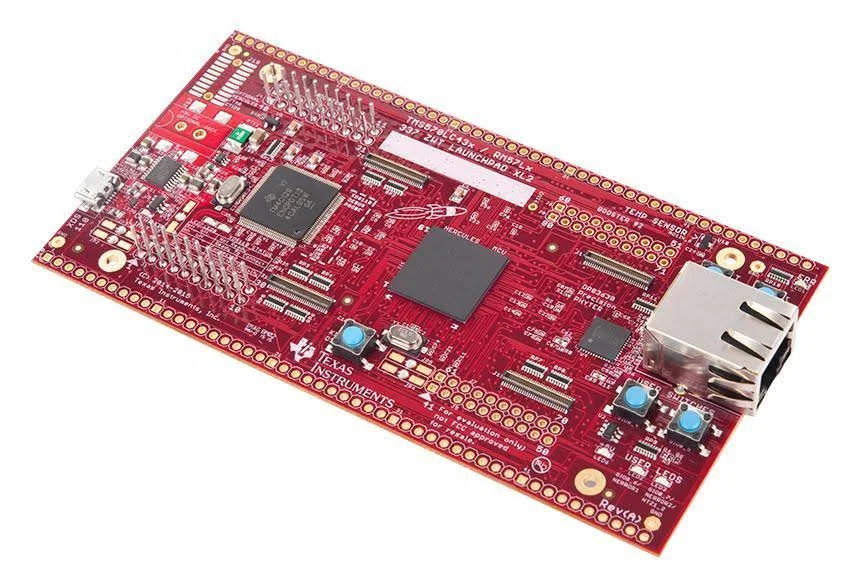

# Porting a new SOC to Zephyr RTOS

## Introduction

This page details my journey in porting Zephyr RTOS to a completely new SOC. The SOC I have chosen is the Hercules RM57Lx series processor from Texas Instruments. I have worked previously with this processor using FreeRTOS and it is a challenging processor.

## CPU Details

The CPU architecture is based on the Cortex-R5F core from ARM. The technical details for this core specification can be found in the technical reference manual published by ARM[^1].

Similarily the next document that can provide more information is the technical reference manual[^2] for the hercules processor I am using.

Finally, I will need to target a reference board or a developer kit to test the code on and the one I have chosen is the [Hercules RM57Lx LaunchPad Development Kit](https://www.ti.com/tool/LAUNCHXL2-RM57L). And for those who have never ysed this platform before, the [HalCoGen](https://www.ti.com/tool/HALCOGEN) tool is provide by the TI for setting up the device. It has similar functionality to the STM32CubeIDE but is not as nearly as nice to use. Maybe by the end of this I will never have to touch the tool again.

[^1]: [ARM Cortex-R5 & R5F Technical Reference Manual](https://developer.arm.com/documentation/ddi0460/d)
[^2]: [RM57Lx Hercules Technical Reference Manual](https://www.ti.com/lit/pdf/spnu562)
